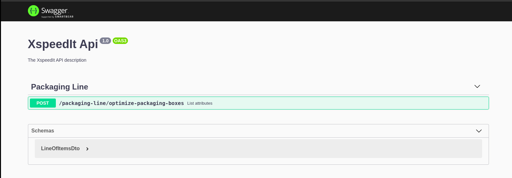

# xspeed-it


## Description

### Algorithm for optimizing the packaging robot in the XspeedIt company

Given the input of the capacities occupied by the items in the packing box, the algorithm extracts from the packing line the first item in the queue, and then proceeds from the position of the next item to be packed to search for the first item or items whose capacity or capacities added together with the capacity of the extracted item is equal to or less than 10, extracting these items also from the queue and forming an output box, then proceeds to repeat the operation of extracting the first item in the new queue and then scroll the queue looking for the first combination of items whose sum of capacities is less than or equal to 10.

## Installation

```bash
$ npm install
```

## Running the app

```bash
$ npm run start
```


> http://localhost:3000 

## License

Nest is [MIT licensed](LICENSE).

